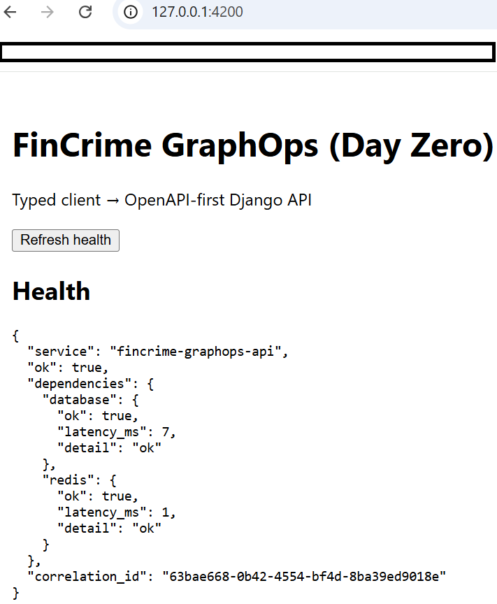
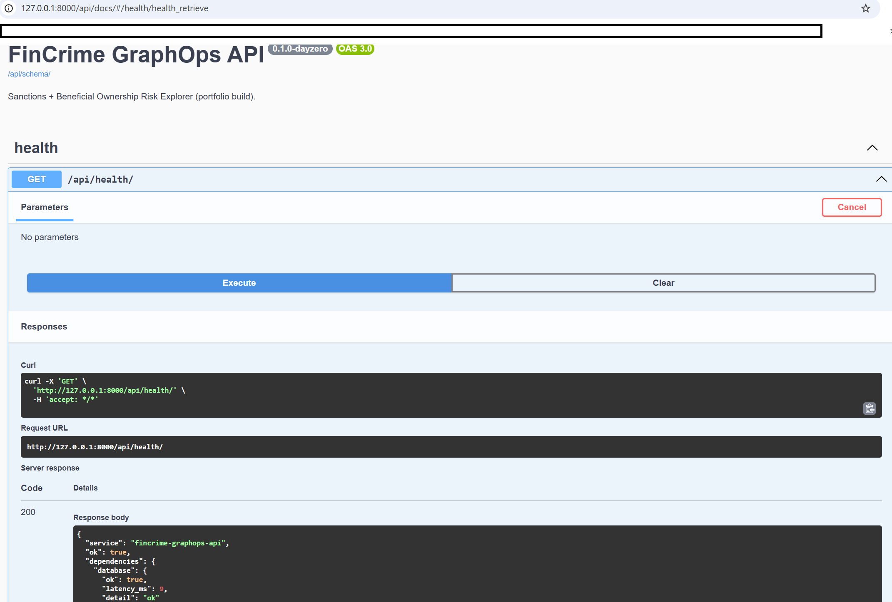
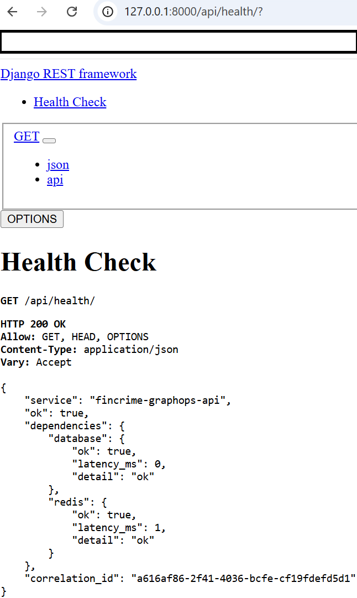

# FinCrime GraphOps — Sanctions + Beneficial Ownership Risk Explorer

**Educational Purpose & Skills Showcase:**
This repository is a portfolio-grade demonstration of Security-by-Design, typed API contracts, OpenAPI-first development, and AI Governance patterns for a London FinTech context.
It is **not a regulated AML system** and must **not be used to make real-world decisions about individuals or entities.**

---

# What it does (Day Zero scope)

- Django REST API with OpenAPI schema and Swagger UI
- Health endpoint validating PostgreSQL and Redis connectivity
- `X-Correlation-ID` middleware for request tracing
- Angular strict-mode typed client calling the health endpoint
- DevSecOps guardrails with pre-commit, mock secret scanning, and dependency audit commands
- AI governance scaffolding for prompt cataloging and evaluation structure

---

# Screenshots

## Frontend Application

Angular client running locally.



---

## API Documentation

OpenAPI documentation served through Swagger UI.



---

## Health Endpoint

Operational health endpoint validating backend dependency status.



> Note: In local development, PostgreSQL or Redis may be unavailable depending on how the environment is started. This is expected in some Day Zero setups and demonstrates dependency-aware health reporting rather than silent failure.

---

# Security-by-Design (Day Zero controls)

- **No secrets in repo:** `.env` files are ignored; use `.env.example` as the template.
- **Correlation IDs:** Every request receives an `X-Correlation-ID` echoed back for traceability.
- **Secure defaults:** Secure cookie flags when not in debug mode, plus clickjacking and MIME-sniff protections.
- **Dependency hygiene:** `pip-audit` and `safety` commands included for vulnerability scanning.
- **Container safety:** Docker images use minimal base images where possible.

---

# AI Ethics and Disclosure

## PII scrubbing

- Inputs to any LLM process must be sanitized.
- Logs must store redacted prompt and output records plus model metadata only.

## Human-in-the-loop (HITL)

- Any match decision, escalation recommendation, or filing suggestion requires analyst review.

## Hallucination mitigation

- If evidence is missing, outputs must explicitly state this rather than infer unsupported conclusions.

---

# Repository structure

```text
fincrime-graphops/
│  .dockerignore
│  .env.example
│  .flake8
│  .gitignore
│  .pre-commit-config.yaml
│  docker-compose.yml
│  Dockerfile
│  README.md
│
├─ai_governance/
│  │  prompt_catalog.json
│  └─evaluations/
│     └─sample_eval.json
│
├─api/
│  │  manage.py
│  │  requirements.txt
│  │  requirements-dev.txt
│  │
│  ├─config/
│  │  │  __init__.py
│  │  │  asgi.py
│  │  │  settings.py
│  │  │  urls.py
│  │  └─wsgi.py
│  │
│  └─core/
│     │  __init__.py
│     │  admin.py
│     │  apps.py
│     │  middleware.py
│     │  models.py
│     │  serializers.py
│     │  tests.py
│     │  urls.py
│     │  views.py
│     └─migrations/
│        └─__init__.py
│
├─client/
│  ├─angular.json
│  ├─package.json
│  ├─tsconfig.json
│  └─src/
│     ├─index.html
│     ├─main.ts
│     └─app/
│        ├─app.ts
│        ├─app.config.ts
│        ├─app.routes.ts
│        └─contracts/
│           ├─entity.ts
│           └─typed-api.service.ts
│
├─docs/
│  └─adr/
│     ├─0001-security-by-design.md
│     ├─0002-openapi-first.md
│     └─0003-ai-governance.md
│
├─infra/
│  └─postgres/
│     └─init.sql
│
├─scripts/
│  ├─dev.ps1
│  ├─lint.ps1
│  └─verify-structure.ps1
│
└─screenshots/
   ├─api-docs-browser.png
   ├─api-health-browser.png
   └─frontend-home.png
````

---

# Prerequisites

Make sure the following tools are installed:

* Git
* Python 3 (`py -3`)
* Node.js and npm
* Docker
* VS Code

---

# Local development

## Backend

```powershell
Set-Location .\api
.\.venv\Scripts\Activate.ps1
python manage.py migrate
python manage.py runserver 127.0.0.1:8000
```

Backend endpoints:

* Health: [http://127.0.0.1:8000/api/health/](http://127.0.0.1:8000/api/health/)
* Swagger UI: [http://127.0.0.1:8000/api/docs/](http://127.0.0.1:8000/api/docs/)
* OpenAPI schema: [http://127.0.0.1:8000/api/schema/](http://127.0.0.1:8000/api/schema/)

---

## Frontend

```powershell
Set-Location .\client
npm install
npx ng serve --host 127.0.0.1 --port 4200
```

Frontend URL:

* [http://127.0.0.1:4200/](http://127.0.0.1:4200/)

---

# Docker

Start the full stack:

```powershell
docker compose up --build
```

This starts:

* PostgreSQL
* Redis
* Django application

---

# Quality gates

## Python lint

```powershell
Set-Location .\
.\api\.venv\Scripts\Activate.ps1
flake8
```

## Frontend lint

```powershell
Set-Location .\client
npm run lint
```

## Pre-commit checks

```powershell
Set-Location .\
.\api\.venv\Scripts\Activate.ps1
pre-commit run --all-files
```

## Dependency audit

```powershell
Set-Location .\api
.\.venv\Scripts\Activate.ps1
pip-audit
safety check
```

If `safety check` is deprecated in your version:

```powershell
safety scan
```

---

# Git workflow

* Run Git commands from repository root (`fincrime-graphops/`)
* Create feature branches from `develop`
* Run linting and pre-commit checks before committing
* Merge feature branches into `develop`
* Merge `develop` into `main` when stable

---

# AI governance artifacts

The repository includes baseline governance artifacts for future AI-assisted features:

* `ai_governance/prompt_catalog.json`
* `ai_governance/evaluations/sample_eval.json`
* `docs/adr/0001-security-by-design.md`
* `docs/adr/0002-openapi-first.md`
* `docs/adr/0003-ai-governance.md`

These artifacts demonstrate governance structure but **do not make the system suitable for regulated or autonomous compliance use.**

---

# Day Zero success criteria

The Day Zero baseline is complete when all of the following work:

* [http://127.0.0.1:8000/api/health/](http://127.0.0.1:8000/api/health/)
* [http://127.0.0.1:8000/api/docs/](http://127.0.0.1:8000/api/docs/)
* [http://127.0.0.1:4200/](http://127.0.0.1:4200/)

And development checks pass:

* `pre-commit run --all-files`
* `flake8`
* `npm run lint`
* `pip-audit`
* `safety check` or `safety scan`

---

# License

This repository is provided for **educational and portfolio purposes only**.
It is not intended for production or regulatory use.

---
